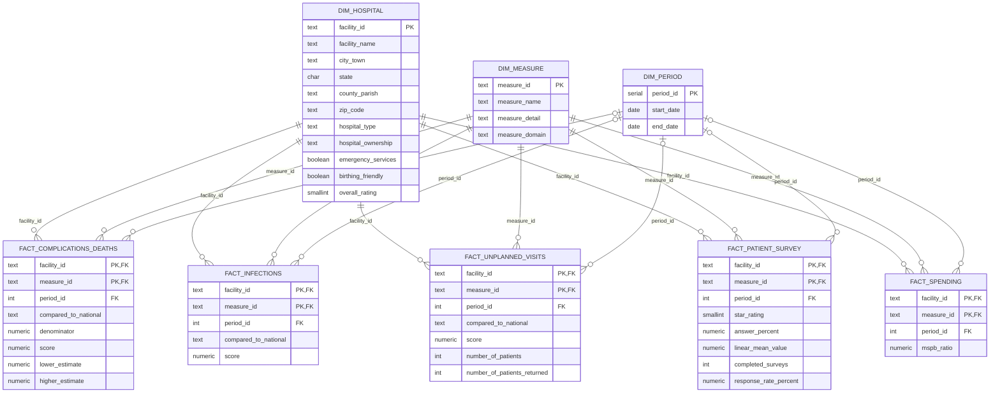

# DSAI-691 Group 6: U.S. Hospital Quality & Cost

**Question:** Does higher hospital spending lead to better quality of care?

A PostgreSQL star schema built from six CMS (Medicare) hospital datasets,
explored with SQL and visualized in Metabase.

## What's in this repo

| File | What it does |
|---|---|
| `create_and_load.sql` | **The whole database in one run:** creates `hospital_quality`, downloads the 6 CMS files, builds the star schema with primary and foreign keys, converts types, validates the load, and runs exploratory queries |
| `run.sh` | Runs the SQL script from Terminal and saves the output to `build_log.txt` |
| `metabase_setup.py` | Connects Metabase to the database and creates starter questions and a dashboard |

## Star schema

Three dimension tables describe *which hospital*, *what was measured* and *when*;
five fact tables hold the measurements. Each fact row is one hospital × one measure.



`load_log` records which CMS files were downloaded, their CMS release date, and rows loaded.

## Step 1: Build the database (one command)

Needs PostgreSQL 13+, the `postgres` superuser login, and internet.

**In pgAdmin 4:** right-click your server (for example "PostgreSQL 16") → **PSQL Tool**, then type:

```
\i '/Users/YOUR-NAME/hospital-quality-db/create_and_load.sql'
```

**Or in Terminal**, from this folder:

```bash
./run.sh
```

A full run takes a few minutes. It ends with `BUILD COMPLETE`. Rerunning rebuilds
everything from fresh CMS data. The CSVs are kept in `/Users/Shared/hospital_quality_data/`.

## Step 2: Connect Metabase (automated)

With Metabase running (`docker start metabase`) and its admin account already created:

```bash
python3 metabase_setup.py
```

It asks for your Metabase login and Postgres password, then creates a database
connection, a **Group 6: Hospital Quality** collection with 5 SQL questions, and a
**Task 2: Data loaded and connected** dashboard.

Manual alternative: Admin settings → Databases → Add database → PostgreSQL, with host
`host.docker.internal`, port `5432`, database `hospital_quality`.

## Data source

CMS Provider Data Catalog, Hospitals: https://data.cms.gov/provider-data/topics/hospitals

| Dataset | CMS ID |
|---|---|
| Hospital General Information | `xubh-q36u` |
| Complications and Deaths - Hospital | `ynj2-r877` |
| Healthcare Associated Infections - Hospital | `77hc-ibv8` |
| Unplanned Hospital Visits - Hospital | `632h-zaca` |
| Patient Survey (HCAHPS) - Hospital | `dgck-syfz` |
| Medicare Spending Per Beneficiary - Hospital | `rrqw-56er` |
